<!--
  This is your PROFILE README. It goes in a repo named exactly after your
  username (e.g. github.com/tejppatil/tejppatil) so GitHub shows it on your profile.
  Widths 370/490 keep the portrait and info card the same height.
-->

<table>
<tr>
<td valign="top"></td>
<td valign="top"></td>
</tr>
</table>

## Tejas Prakash Patil

**Cybersecurity Student · Eager red Teamer · Hungry for the new red world**

)

 

<!-- animated contribution graph, refreshed daily by the workflow -->

